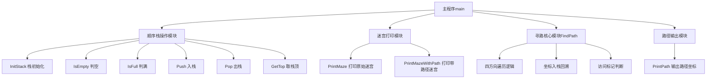

```mermaid
graph TD
    A[主程序main] --> B[顺序栈操作模块]
    A --> C[迷宫打印模块]
    A --> D[寻路核心模块FindPath]
    A --> E[路径输出模块]
    
    B --> B1[InitStack 栈初始化]
    B --> B2[IsEmpty 判空]
    B --> B3[IsFull 判满]
    B --> B4[Push 入栈]
    B --> B5[Pop 出栈]
    B --> B6[GetTop 取栈顶]
    
    C --> C1[PrintMaze 打印原始迷宫]
    C --> C2[PrintMazeWithPath 打印带路径迷宫]
    
    D --> D1[四方向遍历逻辑]
    D --> D2[坐标入栈回溯]
    D --> D3[访问标记判断]
    
    E --> E1[PrintPath 输出路径坐标]
```